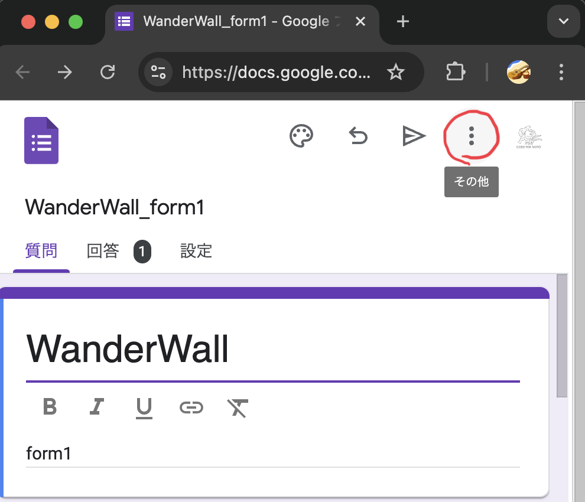
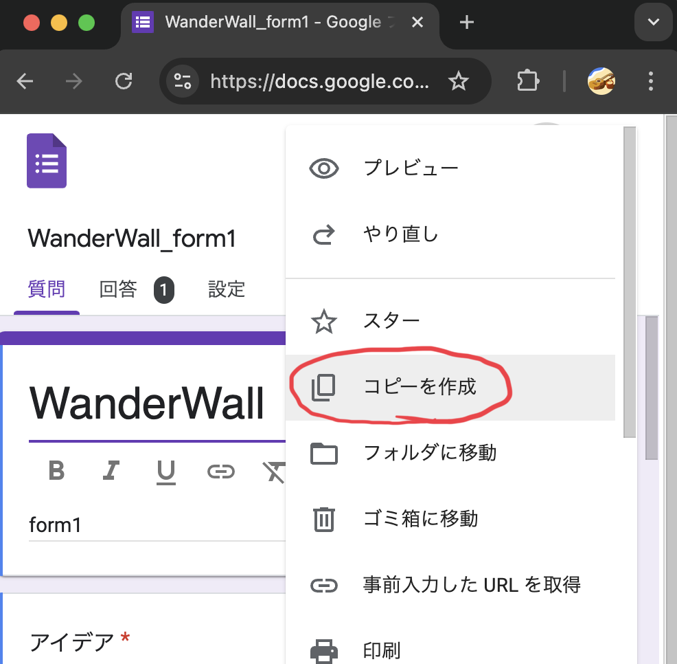
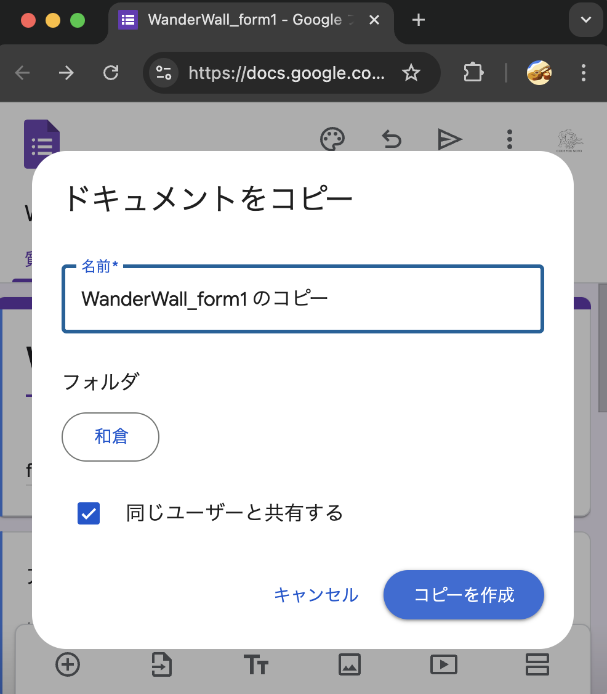
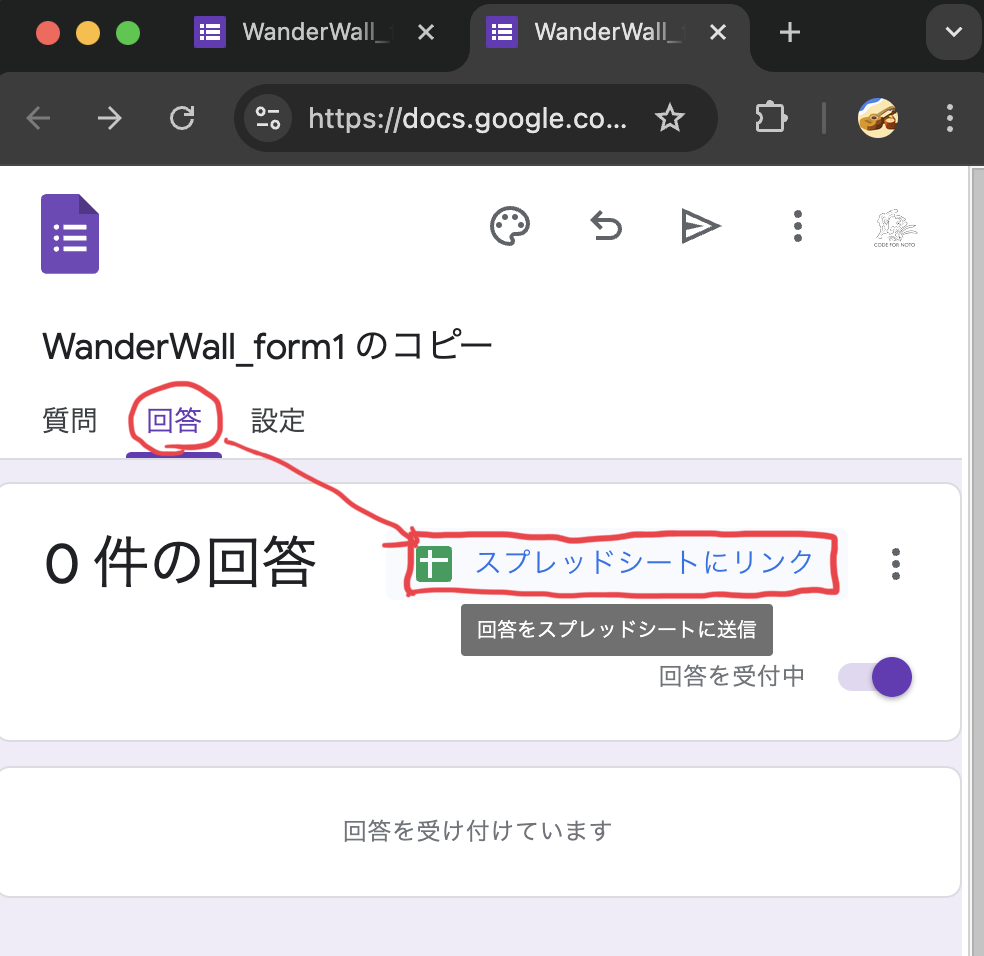
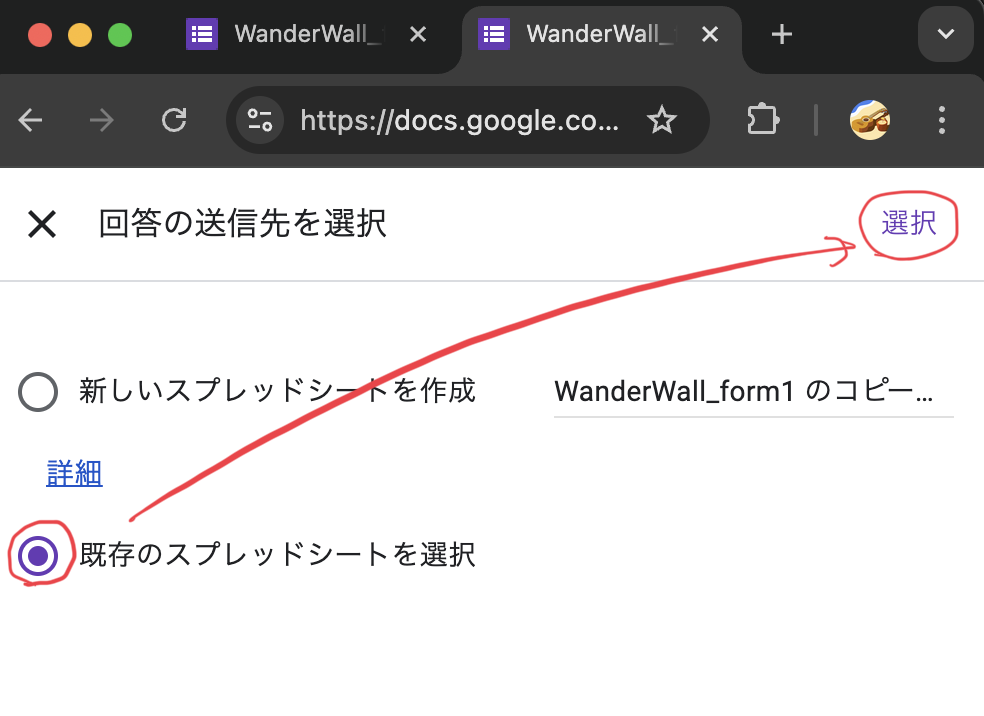
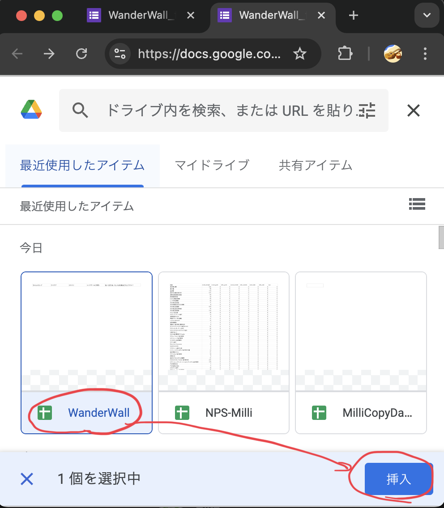
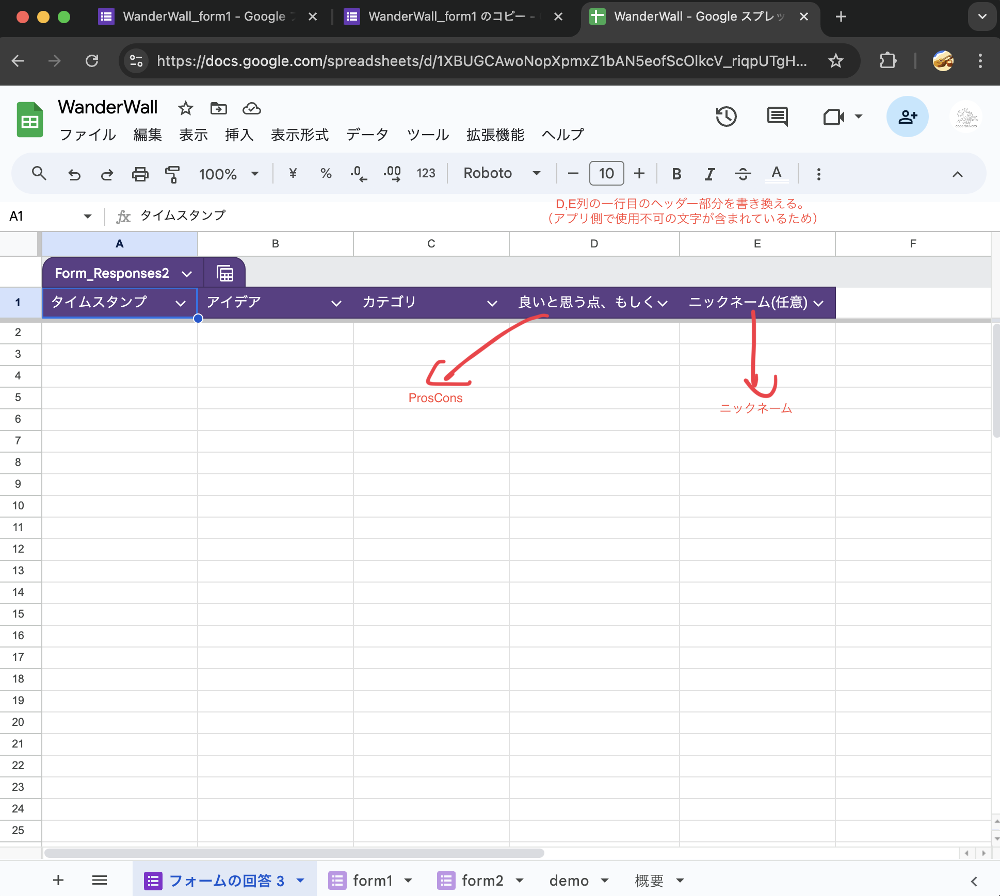
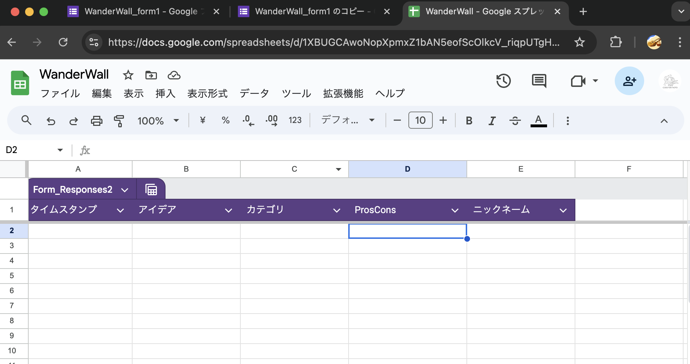

# WanderWall

## Recommended IDE Setup

[VSCode](https://code.visualstudio.com/) + [Volar](https://marketplace.visualstudio.com/items?itemName=Vue.volar) (and disable Vetur).

## Type Support for `.vue` Imports in TS

TypeScript cannot handle type information for `.vue` imports by default, so we replace the `tsc` CLI with `vue-tsc` for type checking. In editors, we need [Volar](https://marketplace.visualstudio.com/items?itemName=Vue.volar) to make the TypeScript language service aware of `.vue` types.

## Customize configuration

See [Vite Configuration Reference](https://vitejs.dev/config/).

## Project Setup

```sh
npm install
```

### Compile and Hot-Reload for Development

```sh
npm run dev
```

### Type-Check, Compile and Minify for Production

```sh
npm run build
```

### Lint with [ESLint](https://eslint.org/)

```sh
npm run lint
```

## アプリケーションの使い方

- 取得するデータは[スプレッドシート](https://docs.google.com/spreadsheets/d/1XBUGCAwoNopXpmxZ1bAN5eofScOlkcV_riqpUTgHRQo/edit?gid=169291098#gid=169291098)の特定のシートをアプリから指定して取得する。シートのヘッダーは自由に設定することができないため、シート追加後はヘッダーがdemoシートと同様になるように変更すること。
- [WanderWall(GitHub版)](https://codefornoto.github.io/WonderWall/)の場合、
  ロゴ画像をクリックすると設定画面に遷移。背景や表示する付箋の数を変更することが可能。
  （仕組みとしては[クエリパラメーター](https://developer.mozilla.org/ja/docs/Web/URI#%E3%82%AF%E3%82%A8%E3%83%AA%E3%83%BC)を利用して各種設定を変更している。設定画面はクエリパラメーターを設定するための補助画面の位置付け）
- 設定は各サイトに合わせて保存できるようにしている。保存先はブラウザのため、異なるPC/ブラウザ間では共有されない。

## 運用

### フォーム追加運用

下記のレポジトリにある画像をファイル名で指定することで表示している。
QRコードを作成し、以下のレポジトリに追加、クエリパラメーターでファイル名を指定する流れで運用する。
https://github.com/codefornoto/images

1. フォーム追加
2. qrコード発行~追加

### フォーム追加

既存フォームからコピーして作成










### QRコード発行~追加

作成したフォームは無料の作成サイト、もしくは以下のmacショートカットから作成。
https://www.icloud.com/shortcuts/49303f89df024076aabad3a695cde28f

下記のレポジトリに作成したQRコードの画像を追加
https://github.com/codefornoto/images
